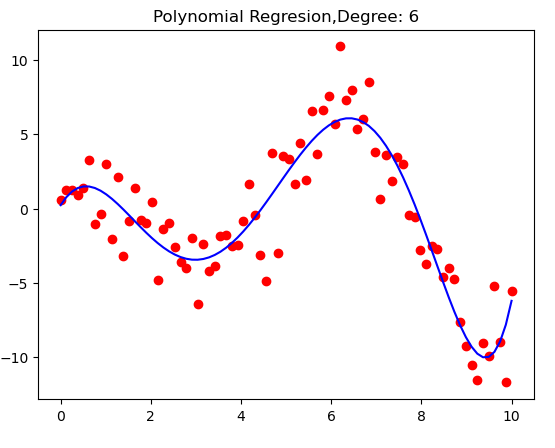

# Linear ve Polynomial Regression ile Örnek Çalışma

Bu projede öncellikle veri setimizi oluşturuyoruz. Veri setini oluştururken regresyon modeline uygun olması için bir method oluşturdum.Bu methodu inceleyip kendi veri setinizi oluşturabilirsiniz. 

Ardından bu oluşturduğumuz veri seti üzerinden regresyon analizleri yaptım.

Son olarak da bu analizleri görselleştirdim. Işte o görselleştirmelerden birisi;

## Contact

 Beni [LinkedIn](https://www.linkedin.com/in/muhammed-talha-bıçak) üzerinden takip edebilirsiniz.

 GitHub üzerinden takip edebilir ve mesaj gönderebilirsiniz: [@talha-bicak](https://github.com/talha-bicak)
